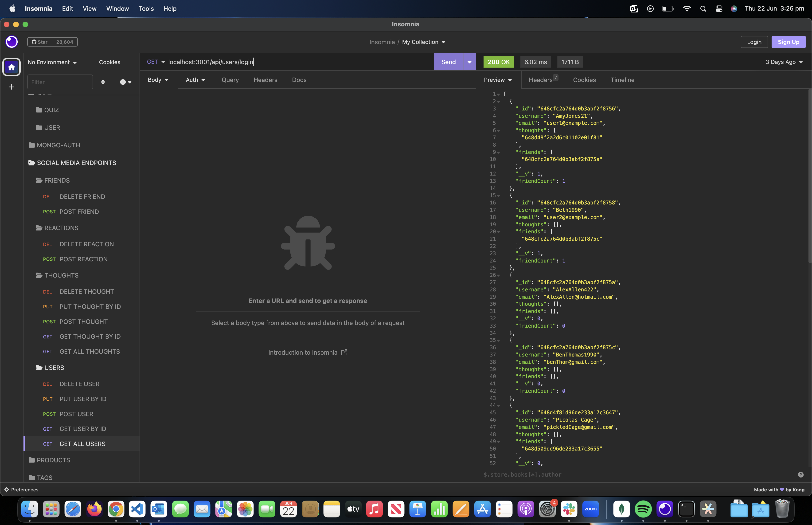

# Project Title
Social Media API
## Description
This Social Media API Provides CRUD Operations for a social media orientated application.

- Users can be create updated and deleted
- Thoughts, reaction and friends can be created updated and deleted to a specific users profile.
## Table of contents
- [Installation](#installation)
- [Usage](#Usage)
- [Contributing](#Contributing)
- [Tests](#Tests)
- [Questions](#Questions)
- [license](#license)

## Installation
- The social media app can be intalled via `git clone SSH ` found in the github repository.
- All project dependencies installed via `npm install`.
- The server can be run via `npm start`.
## Usage
- This project has a specific purpose for providing a social media frontend app with an API that allows for CRUD operations using MongoDB as the database.

### Screenshot

## Built with
### Programming Languages
- JavaScript
### Frameworks
- Node.js
### Libraries / Packages
- Express
- bcrypt
- mongoose
- nodemon
## Contributing
- Travis Nicholson
## Tests
- What testing was performed
## Questions
### links
- [GitHub Username](https://github.com/Travisnicholson90)
- [video walkthrough]( https://drive.google.com/file/d/1LhbmNbO-g_Kusnu14H6bObghp3jmH9jN/view?usp=sharing)

### Email
- For any further question relating to this project, please contact me via email.
[Travis Nicholson](mailto::nicholson_travis@hotmail.com)

## License
[]
 - (https://opensource.org/licenses/MIT)

